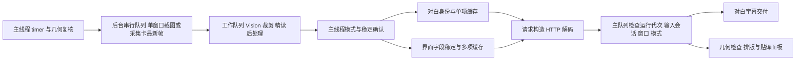

# 译芽 Debug 与回归工作流

每次修复 Bug 前先读本文件。先复现、验证根因、最小修复，再运行回归并报告证据。自动检查验证代码处理与交付；真实设备和用户体验另行验收。

本文件及源码根 AGENTS.md 随 Git 与源码包保留，新 Codex 会话从仓库根进入即可读取。维护者本机的唯一源码为工作区 `.build/yiya-translator-publish-ocj99vs_/fuyi-0.1.0`；其它机器使用正常克隆目录。工作区根仅导航，不能清空包含源码的 `.build/`。

## 数据流与审查基线

完整审查及实施计划见 [架构审查](docs/debug-architecture-audit.md)。关键链路为：



| 模块 | 入口与职责 |
| --- | --- |
| AppDelegate | `objc/LiveCaptionTranslator.m` 的 `start` / `stop` / `timerFired:` 及翻译、显示编排；不是独立管线框架 |
| 输入 | 窗口 `CGWindowListCreateImage(IncludingWindow)`；`FYCaptureCardInput` 的 AVFoundation 会话、单帧槽与 epoch；QuickTime / OBS 作为显示窗口 |
| OCR | `FYOCRManager` 的 Vision、区域回映、精读与合并、模态过滤、对白与字段稳定 |
| 翻译 | `FYTranslationManager` 的请求构造、对白及短文本批次 15 秒 / 显式长正文批次 60–90 秒的数据等待超时、HTTP / JSON 解码、缓存与主线程交付策略；没有独立自动重试队列 |
| 学习状态 | `FYLearningCoordinator` 的句子身份、版本、不完整帧复用及固定阅读；`FYLearningStore` 的 SQLite 持久化 |
| 显示 | `FYWindowManager` / `FYGeometryManager` 的目标与映射；`FYInlineLayout` 的贴译排版；AppDelegate 的字幕、面板、折叠与入口 |
| 诊断 | `FYRuntimeDiagnostics` 元数据内存环；`FYTranslationTrace` 显式启用的文字 JSONL |

对白默认两帧确认，高相似修正三帧；连续同句复用，真正 A→B→A 重新建立身份并请求。失败不缓存，下一周期经过节流可重试：对白 4 秒、界面 1.2 秒。界面字段的确认与保留规则见 [OCR 稳定合同](docs/inline-ocr-stability.md)。

## 快捷命令

以下命令均在源码仓库根执行，需要 macOS 13+、clang / Xcode Command Line Tools 与 Python 3.9+。Debug 不需要接设备、开游戏、填真实 Key、下载 Sparkle 或安装大型平台。

```bash
# 完整无界面入口：源码清单、资料/更新分发、学习与 Debug；CI 使用同一命令
bash scripts/run-headless-checks.sh

# 默认核心检查：测试隔离、诊断、模块、生产链路、Replay 与已知缺口
python3 scripts/debug.py check

# 单一场景，默认跑两遍并比较所有检查点
python3 scripts/debug.py replay tests/fixtures/replay/ocr-jitter.json

# 仅 Replay，给全面验收脚本复用；仍检查失败报告和已知缺口
python3 scripts/debug.py check --replay-only

# 元数据统计，不显示对白
python3 scripts/debug.py trace /absolute/private/path/events.jsonl

# 把已授权的文字日志转成私有草稿，需要补 mock 和正确断言
python3 scripts/debug.py import-trace /absolute/private/path/events.jsonl /absolute/private/path/draft.json
```

`scripts/run-checks.sh` 默认执行无界面入口，随后明确报告桌面检查未运行。只有在安排好的桌面时段设 `FY_TEST_ALLOW_UI=1` 才执行 UI / 更新安装验收；`FY_TEST_COMPILE_ONLY=1` 仅编译这些套件。GitHub Actions 使用 macOS 15 runner，报告上传到工作流附件；本机通过不代表远端 CI 已执行。

2026-10-09 补齐采集卡脚本覆盖：`debug.py check` 和 `run-acceptance.py` 均执行 `SourceManifestTests` 与 `CaptureCardOfflineTests`。后者以仓库中的合成图片调用真正的 `run-capture-card-check.sh offline` 和签名 OCR 工具，验证 Accurate / Fast、指定台词缺失必须失败、文件缺失、硬件门禁及并行正反断言隔离（含强制重建）；不创建窗口、不读取真实凭据或学习库、不连接采集设备或请求翻译。每轮离线核对独立传参、独立报告，同一工具的重建 / 签名串行化。默认无界面入口与 CI 经 Debug 复用这一步。

2026-10-08 审查修复新增了实际请求超时、并发任务释放/取消、服务测试代次复位、AppKit 参数线程、迟到截屏丢弃、窗口轮询快照复用、数据库事务/关库/短暂锁/空回调/坏词典及语法片段枚举回归。OCR 最小文本高度直接观察实际 Vision 请求，不再靠可能读不到源码而跳过的字符串断言。发布构建使用 `-O2 -g`，生成并核对两架构 dSYM UUID；符号文件留在本地发布归档，不随应用包分发。

2026-10-09 补充选项误判与重启 OCR 竞态回归：下半屏含假名、句号的四项选择，以及带姓名标题的选择列表，保留界面判别；短对白豁免要求领先的说话人标签和未结束的对白片段。`lower-choice-menu-auto-mode.json` 经生产自动模式、分组、稳定、缓存和请求交付检查四项独立贴译。`TranslationTracePipelineTests` 在 OCR 边界保持旧、新任务，覆盖实时／手动界面识别的四种停止重启组合；过期 OCR 与译文回调只能释放同运行代次的忙碌状态，不能清除重启后新任务的标记。上述用例不读取真实设备、凭据或学习库，不请求真实 API；实际游戏画面仍需单独验收。

报告在 `.build/debug/<UTC时间戳>-<随机标识>/`：`summary.txt` 便于阅读，`summary.json` 记录命令、执行状态、源码 / 夹具 / 媒体哈希和日志路径；逐场景 JSON 记录检查点、请求源文、字幕 / 界面交付及失败的预期 / 实际。报告目录 0700，文件 0600；私有 Replay 的报告同样可能包含敏感对白，不提交、不附发布包。虚拟时间变化不等待现实秒数；构建 / 进程超时由 `--timeout` 控制，回调期限默认 5 秒，媒体夹具允许 30 秒冷启动。

`check` 每个场景默认两遍；`--repeat 1` 可缩短局部调试，`--repeat 2` 用于最终证据。正常基线成功退出 0；新回归失败、超时、隔离阻断、输出缺失或重复结果不一致均退出非零。`known_gap_reproduced` 只有失败步骤与预期 / 实际严格匹配登记证据才成立；崩溃或其它失败不能冒充已知缺口。有缺口时总结果是 `baseline_passed_with_known_gaps`，不是全部产品验收通过。直接运行对应已知缺口的 `replay` 仍退出 1。

## 诊断记录

普通「运行设置 → 诊断与反馈」只保留最近 5 分钟 / 600 条内存元数据，用户导出才落盘，不含截图、台词、服务地址或凭据。 容量满时优先淘汰常规帧事件，保留近期请求耗时和错误证据；仍受总条数与时间上限约束。优先用它检查权限、窗口、采集、OCR / HTTP 状态和数字错误码。

需要文字链路时，由用户明确启用：

```bash
python3 scripts/translation-trace.py start --seconds 120
python3 scripts/translation-trace.py status
# 复现完成后及时停止
python3 scripts/translation-trace.py stop
```

默认关闭、最长 300 秒 / 1 MiB，文件在 `/tmp/yiya-text-trace-<UID>/events.jsonl`，控制命令会打印确切路径。`start` 清除上一份日志，保留证据时先在私有目录另存。开关动态生效；停止、过期、达到上限或更换会话后，旧回调不继续写入。命令不会启动应用或请求翻译。

新 schema 2 每行含 `event_id`、时间戳、session、cycle、运行代次、输入类型与 epoch；采集成功后附 `frame_id` / `frame_index`。窗口截图的设备 frame index 为 0，用 frame ID 区分；采集卡额外有设备序号。逻辑 `request_id` 关联缓存到最终交付，独立 `http_task_id` 区分长短批次的实际网络任务。旧 schema 无这些新字段时分析器仍支持基本统计。

| 事件 | 判断的问题 |
| --- | --- |
| `cycle_begin` / `capture` | 有调度但没有帧，还是已经拿到可处理图像 |
| `task` | OCR 已调度、开始或完成；`skip: task_busy` 表示上周期尚未完成，没有取得新帧 |
| `ocr: vision_raw` / `vision_raw_crop` | 应用 Vision 适配器输出、源文本去重之前的观察；已经过适配器长度 / 框大小门，不能当作全部 Vision 候选。crop 坐标仍属于局部图 |
| `pass1_filtered` / `merged` / `modal_scoped` | 源观察去重、精读合并或模态范围是否改变了文字 |
| `inline_grouped` / `inline_stable` | 分组问题还是跨帧确认问题 |
| `mode` / `stable` / `skip` | 模式切换、等待、相同已译、节流、空结果或输入过期的具体原因 |
| `dialogue` / `cache` | 提取对白、完整身份原文、版本以及缓存是否复用 |
| `request_submit` / `http_complete` / `request_complete` | 真正提交、HTTP / 网络数字状态、解码成功或失败 |
| `caption_apply/drop` / `inline_apply/drop` | 是否交付、为什么丢弃；apply 不证明面板实际可见 |

不要打印完整请求、认证头、服务地址、缓存键、提示词或 NSError 描述。trace 对 HTTP 错误只记录状态和数字码，不记响应正文。文字日志不保存画面；旧 `FUYI_DIAG` 会保存最新帧，仅在用户明确授权画面诊断时使用，不能默认启用。完整开关和既有边界见 [文字诊断说明](docs/translation-text-trace.md)。

本轮源码的诊断扩充没有自动进入已安装应用。现场取新日志前需按 README 构建 / 安装，再核对运行二进制 UUID；版本号和 build 相同也不能替代二进制核对。

## 界面布局诊断

布局排查先读 [布局诊断与回归报告](docs/inline-layout-diagnosis.md)。固定截图与 OCR 的 P0 → P3 使用生产坐标、分组、跟踪、布局和正文渲染代码；阶段失败立即停止，不靠偏移或平滑消除失败。

```bash
python3 scripts/layout-debug.py check --through P0
python3 scripts/layout-debug.py check --through P1
python3 scripts/layout-debug.py check
```

`debug.py check` 已包含这套检查和 102 帧界面抖动 Replay。六类固定合成截图与 OCR 存在 `tests/fixtures/layout/`。无真实窗口的 NSCell / 正文视图测量不等于桌面浮窗、真实采集映射或游戏验收。

默认和发布构建将 `FY_ENABLE_LAYOUT_DEBUG` 固定为 0；合法控制文件也不能启用保存或覆盖层。下列 `start` 命令仅对明确编译 `FY_ENABLE_LAYOUT_DEBUG=1` 的开发诊断构建有效，该构建不得分发。合成 P0–P3 回归单独打开此编译开关。现场排查须使用开发诊断构建，并在明确安排的桌面时段由用户启用后，才保存画面和文字证据：

```bash
python3 scripts/layout-debug.py start --seconds 120
python3 scripts/layout-debug.py status
python3 scripts/layout-debug.py stop
python3 scripts/layout-debug.py compare /absolute/private/before.json /absolute/private/after.json
```

默认关闭。`start` 明确允许保存原始截图、OCR 和译文；不会启动应用、采集设备或请求翻译。`--no-overlay` 只导出。目录 `/tmp/yiya-layout-debug-<UID>/` 权限 0700，文件 0600；每次会话最多 300 秒、120 帧、300 条布局/决策记录、64 MiB。停止、过期或换会话后，旧回调不得继续写入。诊断文件不进入 Git、发布附件或普通反馈包。

绿色为完整 Vision 观察经实际裁剪回映后的边界，黄色为显示区域中的锚点，蓝色为避让前首选框，红色为最终框；连线显示偏移。PNG 合成原始采集图与当前原生面板的绘制结果，不代表桌面合成器截图。JSON 记录候选、碰撞对象、更新/缓存原因、每块允许的位移范围、预测尺寸和实际 NSCell / 正文尺寸。P0 隔离不调用避让或历史评分；没有新布局的帧明确记 0 次布局。

## Replay 夹具

测试专用驱动 `tests/ReplayTests.m` 调用生产 `timerFired:`。输入图像、Vision 观察和 HTTP 会话可替换；其后的后处理、字段分组、稳定、身份、缓存、请求构造、解码、主队列代次判断及交付都由生产代码执行。它不创建 NSApplication、真实窗口或硬件会话，不加载用户设置 / Key / 数据库。未 mock 的网络会由 `FYTestIsolation` 阻断。

AppKit 终点替换成参数记录器，因此 Replay 验证字幕 / 面板接收到的内容；实际排版和 UI 行为用既有布局 / AppKit 套件及手动验收。`restart` 调用真实 stop，再恢复生产启动用的运行与稳定状态，跳过权限 / UI 启动；`connect` / `disconnect` 使用测试采集卡会话和真实帧槽，不模拟驱动、设备占用或系统授权。

```json
{
  "schema_version": 1,
  "name": "最小对白",
  "mode": "dialogue",
  "source": "window",
  "responses": [{"source": "明日は図書館に行きます。", "translation": "明天去图书馆。"}],
  "steps": [
    {"at_ms": 0, "action": "frame", "text": "明日は図書館に行きます。", "expect": {"requests": 0}},
    {"at_ms": 500, "action": "frame", "text": "明日は図書館に行きます。", "expect": {"requests": 1, "captions": ["明天去图书馆。"], "in_flight": false}}
  ]
}
```

顶层 `stable` 默认 true，`auto_fit` / `auto_mode` 默认 false；默认固定路线以单独测试对白 / 界面，`auto_mode:true` 才走生产自动模式判定。`language` 为 `ja` / `en`，`scope` 为左上原点的归一化区域。帧 `blocks` 使用 `text` 与 `[x,y,w,h]`，原点左下；只有 `text` 时使用字幕位置合成框。所有夹具必须有明确产品断言，草稿不能执行为通过。

帧也可用 `image:"assets/frame.png"`，或 `video:"assets/input.mp4", video_ms:500`。路径相对夹具；不同时提供文字 / blocks 时调用真实 Vision、区域及模态处理。合成 PNG / MP4 已附带，用 `vision-image.json` / `vision-video.json` 验证。媒体哈希写入报告；跨 macOS / Vision 版本不承诺逐字与坐标完全相同，需复核预期，不能据此放宽真实产品要求。`tests/GenerateReplayMedia.m` 可重建这些合成资源，无网络、无截图、无设备。

| 动作或响应字段 | 用途 |
| --- | --- |
| `frame` | 新图像 / 新采集卡 frame；可加 `capture_failed:true` 或数字 `ocr_error` |
| `tick` | 保持输入再调 timer；采集卡没有新帧时应跳过 |
| `advance` | 推进虚拟时间并释放到期响应；时间单调且小于 300 秒 |
| `release` + `request` | 按零起始 HTTP 提交索引释放 `hold:true` 的响应，控制乱序 |
| `window` / `mode` | 改显示窗口 ID / 固定模式，检查旧结果丢弃 |
| `restart` / `disconnect` / `connect` | 改运行代次 / 输入会话并验证迟到响应 |
| `cache_probe` | 清帧级去重门，再走原缓存路径；不是模拟真实用户动作 |
| `translate` | 直接调用生产请求入口，用于补充并发交付测试 |
| response `translation` / `status` / `raw_body` / `error_code` | 合成成功译文、HTTP 错误、解码错误、网络超时 |
| response `release_at_ms` / `hold` | 到指定虚拟时间返回，或保持等待手动 release；省略则当前时间返回 |

`expect` 可断言 `requests`、`sources`、`captions`、`inline`、`errors`、`in_flight`、`pending`、`cancel_calls`、`ocr_calls`、`mode`、`drops`、`events` 等，也可用 `has_reason` / `caption_contains`。responses 按实际提交顺序对应；额外请求、未使用的 mock 或结束仍有待处理任务均失败。不要把生产算法或正确结果复制进 mock；mock 只描述服务边界。

导入日志生成 `draft:true`：保留所选阶段的相对帧时间；需选择模式、输入源，填写服务 mock 和用户预期断言后删除 draft。`modal_scoped` 已是后处理结果，不能恢复前面丢掉的观察；精读可能产生同 cycle 多条 `vision_raw`，需人工辨别。截断日志不能作为完整场景导入。既有 `InlineOCRFrameReplayTests` 仍用于资料页专项历史回放，不作为通用 Replay。

## 当前覆盖与产品缺口

2026-10-10 审查修复：短批超时按显式批次类别设置，不随按钮数量放宽；服务测试使用独立任务 owner 和代次，运行/切窗/切源不再取消测试，服务配置改变或重复测试仍取消旧测试。主窗口隐藏、最小化、位于其它 Space 或完全遮挡时暂停独立预览；重新可见时恢复。采集卡转换在可见预览时为 30 Hz，隐藏或仅 OCR 时为 10 Hz；取帧同时原子取得帧号。旧识别间隔/快速 OCR/等待稳定/预设已从生产 UI、设置读写和运行策略删除，固定对白 0.5 秒、界面 1.2 秒、准确 OCR，保留原稳定流程。测试可显式绕过稳定门以隔离下游边界，生产构建没有该注入开关。完整审查与验证见 [本轮报告](docs/review-dev0.2.1-261009.md)。

2026-10-09 预览卡顿修复：画面预览使用独立的 Common Modes timer（窗口截图 100 ms，采集卡约 33.3 ms） 和串行后台取帧 / 缩放队列，不再等待 OCR 或 HTTP 完成；采集卡预览与 OCR 分开记录帧序号。最多一个预览任务在途，不因暂停 / 重启清除尚未结束的任务槽；代次、窗口、输入源、会话 epoch 与请求序号变化后拒绝旧画面。`TranslationTracePipelineTests` 挂起生产 HTTP 入口的 mock 回复，验证两种输入仍显示连续新帧、没有额外 OCR / 请求，并检查积压限制和迟到画面丢弃。旧 OCR 预览入口在独立 timer 活跃时不覆盖画面。此修复只解耦预览；下方 `latest-frame-while-busy` 的 OCR / 旧字幕缺口仍保留，不能把预览通过当作该缺口修复。详见 [预览卡顿说明](docs/live-preview-stall.md)。

| 场景 | 自动断言 |
| --- | --- |
| 静止与重复 | 两次确认后一次请求 / 字幕，后续静止帧仍 OCR 且不重复翻译 |
| OCR 抖动 | 一两帧近似错字不替换；恢复原文打断候选；省略号变体保留身份 |
| 翻译在途快切 | OCR 继续；已确认新对白/页面替换旧请求；重复帧不重复提交；旧回复与错误不能覆盖新内容，也不能释放正在执行的新 OCR |
| 乱序 | 重启后 C 先返回、A / B 后返回，只有 C 展示；同代次长短批次逆序完成后仍正确归位 |
| A→B→A | 三次真实出现建立不同身份并提交三次；连续身份的 cache probe 复用成功译文 |
| 翻译失败 | 超时、429、无效 JSON 结束网络状态；OCR 不受阻塞；节流内不重试，到期后恢复并缓存成功结果 |
| 输入中断 | 截图失败保留上一条、恢复后处理新对白；采集卡断开作废旧 epoch，重连后的新帧恢复 |
| 窗口 / 模式过期 | 迟到结果有丢弃原因且不更新旧字幕 |
| 界面 | 字段确认、缓存复用及长短批次乱序映射；真实布局由既有模块与 UI 套件验证 |

`known-gaps/english-period.json` 以“应提交英文对白”为断言，当前实际提交 0 次；trace 显示原始 OCR 存在而 extracted 为空，根因证据是 `shouldIgnoreInlineText` 的“含点且无日文字符”分支。本次保留失败证据，不修该产品 Bug。

2026-10-10 追加修复：`inFlight` 只由实时采集/OCR 占有，识别完成即释放；网络使用独立内容 revision 与操作计数。确认新对白/页面时取消旧批次，传输、字幕与排队中的面板交付均检查内容 revision。相同在途文字不重复请求；保持对白两帧确认、恢复原文打断候选及界面修正三帧规则。界面仅位置变化时复用请求，回包使用最新已确认字段坐标，缓存键序列变化时重新提交。服务测试仍独立。显式“翻译当前界面”的快照操作保持原单次忙碌合同，会作废之前的实时网络结果。

原 `known-gaps/latest-frame-while-busy.json` 已升级为普通回归 `latest-frame-while-translating.json`；保留“C 已确认后不得交付 A”的目标，并加强 OCR 连续、相同帧长期去重、取消及迟到错误检查。另有采集卡版本、带稳定门的 `fast-switch-busy.json`、`inline-page-while-translating.json` 与 `cancelled-dialogue-recurrence.json`。后者验证 A→在途 B→A 建立新身份，再次出现 B 不受已取消请求的 4 秒节流影响，迟到 B 不覆盖字幕。只证明这些合成生产链路场景通过，不证明所有真实游戏场景均已验收。当前剩余已登记缺口为英文句点。

## 标准 Bug 修复协议

1. **复现**：记录触发条件、实际 / 预期、应用二进制 UUID、输入源和发生时间。先看已有日志、测试和最小 Replay；尽量减少再次开游戏。新增最小失败夹具，不把历史测试的通过记录当成本轮复现。
2. **定位**：按同一 session / cycle / frame / request / HTTP task 追踪输入、raw OCR、后处理、稳定、缓存、响应和展示；区分没采集、没识别、被过滤、等待、缓存、请求失败和结果被丢弃。
3. **验证根因**：证明故障首次出现在哪个边界，给出原始观察与失败断言。证据不足时写“尚未确认”，补诊断或下一次最短采样；禁止按症状直接猜改代码。
4. **最小修复**：局部修正并保持已有产品合同；有必要的设计选择先列待确认项。回归必须覆盖同一生产逻辑，不能靠删除测试或接受错误输出获得通过。
5. **自动验证**：新增夹具修复前失败 / 修复后通过；运行相关模块和 `debug.py check`。OCR / 布局改动追加相应专项，UI 改动在明确的桌面测试时段运行 AppKit 套件。记录命令、退出码、源码哈希及报告；源码变化后先前报告不代表最终代码。
6. **报告**：根因及证据；文件与关键逻辑；新增 / 修改回归；实际执行及结果；已知缺口、未验证范围与风险；是否需要手动验收及具体最短步骤。使用“该场景自动验证通过”，不无证据宣称彻底修复。

## 相关检查与常见排查

采集卡检查按故障边界选择，不能拿一种检查替代另一种：

| 变更或问题 | 必须补充的检查 | 范围 |
| --- | --- | --- |
| 源文件清单、诊断脚本、OCR 或对白提取 | `python3 tests/CaptureCardOfflineTests.py`；统一 Debug / 验收已包含 | 合成图片 → 当前生产 OCR / 对白提取，包含失败断言；无硬件 |
| 真实画面漏字或对白残缺 | 用户明确授权的已保存图片：`bash scripts/run-capture-card-check.sh offline /absolute/private/frame.png '必须包含的文字'` | 当前源码处理该画面；原图与文字报告仅私有保存 |
| 相机权限、设备列表、收不到帧、会话释放 | 安排设备时段后显式调用脚本的 `inspect` / `authorize-ui` / `capture` | 新的真实设备证据；不得自动混入 headless / CI |
| 对白被误判贴译、跨帧身份、缓存或迟到字幕 | 自动模式 Replay、稳定与交付测试 | 离线脚本仅调用 OCR / 对白提取，不验证主循环自动模式与异步交付 |
| 字幕白底、贴译位置、QuickTime / OBS 显示映射 | 相关 AppKit / 映射测试与现场验收 | OCR 检查不证明实际浮窗外观或映射 |

设备探针的进程退出 0 只表示程序完成，验收还须检查 `status.json`：列表检查为 `inspected_only`；取帧须为 `captured_requested_frames`、达到请求帧数、`session_released=true`、`audio_inputs=0`、`screen_capture_used=false`。无权限、无帧、超时、被门禁阻断均不能写成采集通过。首次授权、拔插与长期运行另外验收。

```bash
python3 tests/CaptureCardOfflineTests.py
bash scripts/run-module-tests.sh
bash scripts/run-translation-trace-tests.sh
bash scripts/run-diagnostics-tests.sh
bash scripts/run-dialogue-grammar-tests.sh
# 先准备完整验收，UI 只编译；不占桌面、不等于 UI 通过
python3 scripts/run-acceptance.py
# 已安排桌面测试时段后，执行相关真实 AppKit 测试
FY_TEST_ALLOW_UI=1 scripts/run-learning-app-tests.sh InlineTranslationPipelineTests
# 全套 UI / 剪贴板验收，仅在安排好的时段运行
python3 scripts/run-acceptance.py --ui
```

所有产物与日志保留在忽略的 `.build/` 或测试私有临时目录。全面检查入口已接入 Replay；旧套件和布局断言继续使用，不另建依赖平台。

| 现象 | 先检查 |
| --- | --- |
| 一直没有译文 | 当前构建、权限、显示窗口、capture；采集卡 frame index 是否增长，是否只是 busy 或无新帧 |
| 少半句 | raw → pass1 → merged → modal → extracted；干净源图不能按已有译文过滤原文 |
| 一句重复请求 | logical ID / HTTP task 是否长短批次；cache miss、身份 / 版本、失败重试或 A→B→A 是否属于既定行为 |
| 旧字幕覆盖 | generation / epoch / window / mode 的 drop；同代次新内容检查 content revision；未确认的一帧变化仍受稳定规则保护 |
| 贴译闪动或错位 | inline_grouped / inline_stable 的块和位置；几何代次、映射与布局；最后核对真实面板 |
| 测试超时 | 看该步骤日志、native failure 与 task 状态；首次 Vision 初始化可用媒体夹具的回调期限，不把超时当通过 |

模块中的字体检查以 60 秒为原生进程期限，超时先采样堆栈再结束，并作为失败保留。2026-10-10 的 macOS CI 堆栈确认未安装圆体的 `NSFont fontWithName:` 会等待系统字体下载；主题和贴译共用 `FYLocalFontNamed`，先按 CoreText 的可用 PostScript 名称检查，仅查找本机可用字体，缺失时走已有系统字体回退。`LocalFontTests` 检查缺失名称不进入 AppKit 匹配及真实主题/布局选字一致；字号稳定夹具用生产排版寻找当前字体的换行边界，不依赖机器安装可选字体。

## 最短手动验收清单

只在自动测试覆盖不到的范围请求用户验收，列出具体画面 / 动作，不让用户重复全套。

- 本轮构建与安装二进制 UUID 一致；启用诊断的运行版确实包含新调用点。同版本真实 Key 只检查是否已配置及文件权限，不输出内容。
- QuickTime / OBS 静止对白停留、A→B→C 快切、A→B→A；核对实际字幕内容、时机和遮挡。快切缺口解决前不能标为通过。
- 采集卡首次相机授权、QuickTime 共用、停止释放、拔插重连；窗口输入屏幕录制权限、关闭 / 重建目标、多屏 / 全屏投影的映射。
- 界面菜单 / 长正文、窗口移动 / 缩放、字体设置、折叠及打开的选择列表；核对实际位置、可见性、原生选择 / 复制与交互身份。
- 按该 Bug 的最短步骤恢复失败，必要时连续运行；30 分钟稳定性、另一台机器、Intel 实机及其它 macOS 单列，不由合成检查推定。

本次建设只更新源码和自动化，没有安装、改变版本、推送或发布；无需为了验证 Replay 启动游戏。后续现场取证仅针对剩余设备 / 体验范围。
