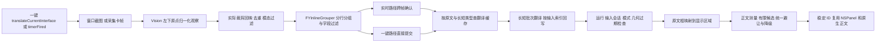

# 译芽界面翻译布局诊断与回归报告

2026-10-10：默认及发布构建禁用画面布局诊断；控制文件不能开启保存。历史现场采样说明仅适用于显式编译 `FY_ENABLE_LAYOUT_DEBUG=1` 的开发诊断构建，不能分发。合成布局回归独立启用该开关；详见 [本轮审查](review-dev0.2.1-261009.md)。

## 2026-10-09：普通贴译统一移除标题

用户确认普通贴译只显示译文，展开阅读卡保留字段标题。原先普通长卡的完整样式包含 37 pt 标题带，空间不足时才尝试无标题样式，因此标题时有时无。本次普通候选、显式卡框、可读高度门与原生正文渲染统一不预留标题；展开阅读通过独立标志保留标题带。顶部现有内边距继续拖动，正文点击和滚动、折叠入口、字号下限及碰撞规则保留。

新增无窗口原生视图回归，修正前 P1 因可见标题与预留高度失败：正文起点 55 pt；修正后正文起点为现有内边距 18 pt。检查实际正文高与卡高一致、窄空间不因不存在的标题折叠、所有普通候选均无标题、展开阅读标题与测量一致、面板复用切回普通时不残留标题，以及顶部拖动/正文区域分离。最终 `python3 scripts/layout-debug.py check --output .build/layout-debug/no-heading-final` 通过完整 P0 → P3，132686 条断言；修正前报告为 `.build/layout-debug/no-heading-before/summary.json`。

用户明确安排的两分钟桌面时段为 UTC 16:38:31 至 16:40:31（本地 00:38:31 至 00:40:31）。最终使用 `FY_TEST_ALLOW_UI=1 bash scripts/run-learning-app-tests.sh <Suite> <Output>` 执行 `InlineTranslationTests`、`InlineAdaptiveLayoutTests`、`InlineFoldReadTests`，三套均在时段内退出 0；折叠套件 135 条断言。自适应套件的三段真实 OCR 夹具因缺少文件跳过，不算执行通过；没有连接设备或调用真实翻译服务。日志为 `.build/layout-debug/no-heading-{ui,adaptive,fold}-final.log`。

桌面首轮发现：显式卡框内容创建仍沿用 55 pt 旧拖动区，已在创建时按真实标题带设定；两个旧样本移除标题后已不再触发折叠/滚动，所以折叠视口改成确实放不下三行正文的高度，滚动用足够长的固定合成译文，原来的行为断言均保留。首轮六项失败日志为 `.build/layout-debug/no-heading-adaptive-run.log`，不能计为通过。

最终 `python3 scripts/debug.py check` 本会话退出 0，报告 `.build/debug/20261008T164031Z-45b538/summary.json`，62 条结果、全部最终源码/夹具哈希匹配、基线通过并保留两个其它已知产品缺口。此前首轮核心回归后其它会话更新了检查脚本，本次已按新入口完整重跑，包含源码清单及合成采集卡离线检查。

`bash scripts/install-app.sh` 最终双架构构建、安装和签名检查通过，本机译芽已重新打开，同为 0.2.1 build 24；安装与构建 UUID 一致：arm64 `BE24A887-6266-36C3-B0E7-D0735BE051BB`、x86_64 `FA7EC25D-7FF9-3A5F-9722-7FAF63AAE55E`。凭据只检查元数据且保持不变。字体、颜色与透明度未改变，卡片会按移除标题后的较小尺寸重新落位；本轮尚未据此宣布真实游戏观感验收通过。公开附件未更新。

## 2026-10-09：这次跨栏偏移的结论

现场正文跑进左侧菜单，主因已定位到布局候选：下方被另一个真实字段挡住，上方出界，右侧候选也因出界被丢弃，于是左侧优先于覆盖自身。该次 OCR 映射和实际面板坐标一致；相同窗口尺寸的连续记录没有自行跳动。删除装饰误识别不能改变正文的错位结果。

归档旧工作副本会把右侧候选向可见区域内收，现役代码缺少这一步。只恢复这处边界处理及原来的左侧边界门，保留现役测量、碰撞检测、评分、字号下限和降级；没有回滚整份文件。无法证明先前安装的应用必然来自这份旧工作副本。

新增合成夹具 `tests/fixtures/layout/right-boundary.json`，通过生产布局复现：修正前右侧出界、正文跑左；修正后右侧内收。100 次独立布局与 100 个连续帧一致；右侧被其它原文字段占满时不能强行放置。完整 P0 → P3 通过，132662 条断言；密集样本仍明确报告 15 块不可贴放。已授权现场输入的私有回放也通过，卡片及正文尺寸不变，较大窗口既有结果不变。私有素材及分析仅存本机忽略目录。

执行 `python3 scripts/layout-debug.py check --through P2 --output .build/layout-debug/right-boundary-before` 修正前退出 1；`python3 scripts/layout-debug.py check --output .build/layout-debug/right-boundary-after` 修正后退出 0。统一 `python3 scripts/debug.py check` 的相同源码报告为 `.build/debug/20261008T162340Z-b2f976/summary.json`：60 条结果、源码哈希未变、基线通过，保留两个已登记的其它产品缺口。本会话单独启动统一检查时遇到另一个检查正在运行，待其完成后核对全部源码及夹具哈希相同，复用该完成报告。

`bash scripts/build-app.sh` 与 `bash scripts/install-app.sh` 成功；本机 0.2.1 build 24 已安装并重新打开，安装二进制和构建 UUID 一致：arm64 `F9FEED2E-EEF2-335E-BA4C-B2645BE7A8A1`、x86_64 `DDAAD90A-E6B9-385F-ADE8-C02C6601DD06`。dSYM UUID 核对及安装签名检查通过；凭据文件只检查元数据，安装前后未改变。公开附件未更新，本轮没有开启新的现场记录或运行桌面 UI 测试。

风险：靠右边界的卡片可能覆盖自己的一部分原文，但仍严格避开其它字段与译文。其它页面没有据此宣称全部解决；实际游戏观感及新安装的桌面表现需要单独验收。

以下是 2026-10-08 的诊断和验证历史。

2026-10-08。本轮建立了可导出的布局观测和按顺序执行的 P0 至 P3 回归，复现并局部修正两个缺陷：紧凑长卡复用时正文宽度改变，以及过期的几何回调清空更新后的布局缓存。固定样本的定位、分组、尺寸、碰撞和连续帧检查通过。现场首次贴歪及其它页面的远距离偏移，仍需用新诊断取得对应画面证据，不能据合成测试宣称三类问题全部解决。

## 实际数据流



| 边界 | 当前生产代码及真实职责 | 待验证的现场问题 |
| --- | --- | --- |
| 采集 | `LiveCaptionTranslator.m` 的 `copyCapturedImageForWindow:` 使用 IncludingWindow、IgnoreFraming、NominalResolution；采集卡使用最新原始视频帧 | 目标窗口及当前视频显示区域是否对应实际游戏内容 |
| Vision | `FYOCRManager.m` 的 `recognizeTextItemsInImage:`；boundingBox 左下原点、0 到 1 | 原始绿色框本身是否包住正确文字，是否漏读或多读 |
| 裁剪与精读 | `recognizeImage:topLeftScope:`、`recognizeEnlargedImage:visionRegion:` 使用实际像素 crop，再由 `remapItems:fromPixelCrop:imageSize:` 回到整图坐标；精读最多放大 2 倍且有尺寸上限 | 裁剪、精读、多行范围是否首次改变框的归属 |
| 坐标与缩放 | `FYGeometryManager frameForNormalizedBox:inViewport:`：显示原点加归一化坐标乘 viewport 尺寸，最后 integral；Quartz 转 AppKit 只翻一次 y | Retina 不应再乘一次 backingScale；现场视频区域校准是否准确 |
| 显示区域 | `inlinePlacementRect:`；窗口输入用整个目标窗口，采集卡用经校准/内容定位的视频矩形，不能用等比猜测冒充有效映射 | OBS 工具栏、留黑、裁剪、窗口切换、自动定位是否影响 viewport |
| 分组 | `mergedInlineTextItemsFromItems:` → `FYInlineGrouper blocksFromLines:`；再 `filteredInlineTextItems:strict:`，保留全部有效字段 | 原始行何时被合并；相邻按钮与多行正文是否保持正确边界 |
| 跨帧确认 | 实时 UI 路径经 `FYInlineOCRFrameStabilizer observeItems:`；一键路径不经过这一层，随后仍有布局身份匹配和小抖动缓存 | 文本修正、漏块、真正换页和坐标抖动是否被区分 |
| 翻译与回写 | `translateInlineTextItems:` 的缓存键为归一化原文及长短类型；长短批次独立，按 indexes 写回；`handleInlineTranslationResult:` 做过期检查 | 无意义请求、错索引、旧回调是否改变当前状态 |
| 测量与候选 | `FYInlineLayout.m` 的 `prepareShortPlacement:`、`prepareLongPlacement:`、`candidatesForPlacement:` | 黄色锚点正确时，蓝框的大小及首选方向是否合理 |
| 碰撞与降级 | `filterCandidates:`、`candidate:resolvingCollisionsWithin:`、`reflowCandidateForPlacement:`、`layoutRequestsWithHeightCache:` | 红框与蓝框之间是哪些原文/译文阻挡；是否应降级 |
| 渲染与缓存 | `showInlineTranslations:forItems:placementRect:`、`updateInlinePanel:`、`updateInlineLongCard:`；内容、几何、样式和细小 OCR 变化决定是否重排 | 预测框、实际 panel、正文 viewport 和 NSCell 是否一致 |

普通窗口 frame 以 AppKit 屏幕点计；OCR 图像尺寸以像素计。归一化框直接乘显示区域的点尺寸，因此不是把像素再乘 Retina 倍率。坐标最终取整允许不足 1 pt 的边缘外扩；这不能解释每条文字各不相同的大幅偏移。首次蓝框会依据可用方向选下/上/左/右/覆盖自身，红框会经过候选合法性与评分选择；不同偏移不自动等于坐标转换错误。

本轮交付代码的关键位置（行号对应本轮源码）：

| 入口 | 文件与行号 |
| --- | --- |
| 一键入口 / 采集 / 显示区域 | `objc/LiveCaptionTranslator.m:5186` / `:8530` / `:8402` |
| Vision / crop 回映 / 跨帧确认 | `objc/FYOCRManager.m:1746` / `:1432` / `:222` |
| 屏幕点转换 / 分组 | `objc/FYGeometryManager.m:322` / `objc/FYInlineLayout.m:784` |
| 翻译缓存 / 过期回调 / 渲染缓存 | `objc/LiveCaptionTranslator.m:5927` / `:3451` / `:6143` |
| 长卡真实视图更新 | `objc/LiveCaptionTranslator.m:7056` |
| 短 / 长框测量、候选、碰撞、有限重排 | `objc/FYInlineLayout.m:1172` / `:1220` / `:1267` / `:1454` / `:1678` |
| 诊断帧创建 / 结构化与 PNG 导出 | `objc/FYInlineLayoutDebug.m:156` / `:201` |

## 三类症状的证据与结论

| 症状 | 已证实的事实 | 根因归属及当前结论 |
| --- | --- | --- |
| 第一次出现就贴歪 | P0 在固定截图/固定观察、单框、无避让/历史评分的条件下通过。覆盖负屏幕原点、上下原点转换、实际 crop 回映、1 倍与 2 倍图像尺寸 | 尚未确认现场根因。不能用后续长卡更新缺陷解释首次出现；需比较绿色原始框、黄色映射锚点与蓝色初始框，检查 OCR 和显示区域映射 |
| 密集文字发生碰撞或偏移很远 | 固定密集样本 36 块：21 可贴放、15 明确 unplaceable；连续 100 次得到相同结果，可见框无正面积重叠、无其它原文遮挡，均在有限关联范围内。另复现长卡正文宽度 256 → 268 pt 的渲染合同错误 | 尺寸/渲染缺陷已证实；是否导致现场某次碰撞仍需画面关联证据。现有算法不是无限推挤，不能凭症状替换为另一套偏移规则 |
| 静止时跳动或反复布局 | 相同观察及 ±0.001 归一化坐标噪声的连续帧保持布局与 ID；102 帧生产 Replay 只提交一次翻译。异步测试证明过期几何结果把更新后的 result 和 identity cache 清空 | 已证实一个跨帧状态缺陷，可导致不必要的重新布局；本轮修正。尚不能据此把所有现场静止跳动归结为这一原因 |

OCR 识别本身没有在本轮被替换或调参。坐标算法在固定输入中通过，真实显示区域校准仍未验收。两个修正分别属于正文渲染尺寸合同和异步状态归属。

## 最小修正与风险

1. 长卡更新不再通过 `scroll.frame.width + 36` 猜回卡片宽度，直接使用实际卡片 frame 宽度，再由布局器内边距计算正文。280 pt 卡片、12 pt 内边距的正文正确保持 256 pt；修正前实际变为 268 pt。相同卡片尺寸下正文内边距/标题带变化时，比较实际与目标正文区域，只有不一致才重建内容；其它就地更新继续保留滚动视图。
2. 旧几何结果仍按原检查丢弃，但不再清空当前布局与身份缓存。当前几何的复核、窗口切换及停止仍由原有缓存失效入口负责。修正前异步回归的 `layout_preserved` 与 `identity_cache_preserved` 都为 false；修正后均为 true。

第一项可能改变原先错误宽度下的换行与滚动范围；正文区域确实变化时会重建视图，因此该次滚动位置需要桌面复验。第二项必须保持真正窗口/场景变化时的正常失效，相关模块和已有 stale-window / stale-mode / 异步 Replay 一并回归。没有改字号、锚点偏移、碰撞评分、OCR 阈值或平滑策略。

## 诊断可视化与导出

实现为 `objc/FYInlineLayoutDebug.{h,m}`，一键及实时采集均生成不可变的 frame/session 上下文；实际 crop 被同步传到原始 Vision 观察，异步交付保留原帧上下文。完整 Vision 观察在适配器长度/尺寸过滤前记录。

| 显示 | 含义 |
| --- | --- |
| 绿色 | 原始 Vision boundingBox 经该次实际 crop 回映到整图后投到显示区域 |
| 黄色十字 | 转换后原文字段左下锚点 |
| 蓝色 | 生产候选生成器的首选位置，尚未避让 |
| 红色 | 最终译文面板 frame；无法贴放的块不画伪造红框 |
| 红色连线与序号 | 原文锚点到最终框的偏移；序号对应 JSON blocks 顺序 |

每块 JSON 包含稳定/输入 ID、原文、原始块与行框、源下标、分组置信度、映射框/锚点、译文、字体、预测 panel/正文尺寸、实际 panel/label/正文 viewport 与 NSCell 测量、避让前后坐标、碰撞对象、候选合法性/评分、长卡变体、更新原因、前帧位移、允许的自动原点范围。记录还包含 frame ID、采集及布局时间、输入/几何代次、采集图像像素尺寸及原始 Vision 图像尺寸/裁剪变换。

每次自动落位的原点必须留在所属 sourceFrame 的关联域内：横向下界为 `source.minX - label.width - gap`，上界为 `source.maxX + gap`；纵向下界为 `source.minY - label.height - gap - (tolerance + 0.5)`，上界为 `source.maxY + gap + (tolerance + 0.5)`。JSON 逐块给出具体 pt 值和相对初始框的最大 x/y 位移。此范围汇总现有候选与有界空隙搜索的几何边界；本轮没有为症状新增某个统一像素偏移。覆盖自身的实际搜索范围还更严格，要求与所属字段保持相交。手动拖动单独标记，不套自动位置预算。

空间搜索最多共同调整 3 个相邻自动面板；长卡候选只前进、最多 12 轮，有可读字号下限。放不下就用已有折叠入口或界面译文列表，不缩到不可读、不无限移动。

导出文件为 `<frame>.source.png`、`<frame>.<序号>.overlay.png`、对应 `.json` 和缓存/丢弃 `.decision.json`。运行时 overlay.png 合成原始采集图、当前原生面板绘制像素及诊断线；它不是桌面合成器截图。合成回归未创建 NSPanel，`render_verified:false` 明确表示该记录没有真实面板终点。缓存帧的 `layout_reused:true`、`changed:false`、`layout_pass_count:0` 区分“采集/绘制”与“重算布局”。

启用后会增加截图编码、原生视图测量与私有文件写入的开销；该模式用于短时采样。默认不保存画面/文字，普通反馈包不包含这些文件，测试版共享实例不读取用户的诊断控制。

## 可执行回归与验收标准

在源码根执行：

```bash
# 严格按阶段停下；每个阶段失败立即非零退出，不进入后续阶段
python3 scripts/layout-debug.py check --through P0
python3 scripts/layout-debug.py check --through P1
python3 scripts/layout-debug.py check --through P2
python3 scripts/layout-debug.py check

# 真实 timer/cache/异步交付路径；默认运行两遍比较检查点
python3 scripts/debug.py replay tests/fixtures/replay/inline-layout-jitter.json

# 包含布局检查、模块、诊断、生产 Replay 与已登记缺口
python3 scripts/debug.py check
```

`tests/fixtures/layout/` 保存稀疏菜单、密集菜单、多行正文、静止画面、轻微坐标抖动和菜单切换的固定合成 PNG 与 OCR JSON；切换同时保留前后两张图。`InlineLayoutDebugTests.m` 调用生产分组、映射、跟踪、布局、原生正文创建及真正的 `updateInlineLongCard:`，只以无窗口 sink 替换 NSPanel 和硬件端点。没有另写布局算法。

| 阶段 | 必须通过的判定 |
| --- | --- |
| P0 | 原点和 crop 回映与解析期望一致，1/2 倍像素得到相同屏幕点；单框首选位置正确，诊断 crop 上下文不泄漏；不用避让、前帧评分或动画 |
| P1 | 稀疏/密集独立条目不误合，多行正文与相邻按钮分组正确；预测正文高度/viewport 与生产渲染一致；原生短标签可容纳文字；同文本复用保持正文宽高；改变正文修饰时不能复用旧几何 |
| P2 | 三种固定输入各运行 100 次，输入及初始状态相同时 frame、mode、字号、ID 相同；无正面积译文重叠/其它原文遮挡；最终原点满足每块位移范围；最多 12 轮；拥挤样本明确降级 |
| P3 | 100 个以上静止/微噪声确认帧的 frame、mode、字号、ID 不变，changed=false；换页确认后旧身份消失；过期回调不能删除新缓存；102 帧生产 Replay 只有一次请求且译文与原文按输入索引对应 |
| 诊断边界 | 停止、换会话、过期或不安全权限后，不继续写截图/OCR/译文；缓存记录无虚假的新布局次数 |

已保存两份修正前失败证据：`.build/layout-debug/before-fix/summary.json` 的 P1 宽度错误，以及 `.build/layout-debug/before-stale-fix/summary.json` 的 P3 新缓存被清空。局部修正后完整阶段结果在 `.build/layout-debug/all-final/summary.json`。测试、编译、安装与游戏验收分别记账；最新统一检查和构建路径见下方验证记录。

## 最短现场采样

需要先使用包含新诊断的构建；已有安装不会仅因新脚本出现而得到诊断能力。桌面测试仍按 `DEBUG_WORKFLOW.md` 安排时段，本轮不自动启用真实画面保存、重启应用或调用真实服务。

```bash
# 用户开始一段明确授权的短时画面/文字诊断；最长 300 秒
python3 scripts/layout-debug.py start --seconds 120
# 在原故障页面点一次“翻译当前界面”，静止 10 秒，再切换一次菜单
python3 scripts/layout-debug.py stop
python3 scripts/layout-debug.py compare /absolute/private/before.json /absolute/private/after.json
```

先看绿色框是否与原文字形一致。绿色正确而黄色相对实际游戏区域错位时，追查视频显示区域、crop 和缩放；黄色正确而蓝框大小错误时，追查测量；蓝框正确而红框偏远时，按候选碰撞/拒绝原因和位移范围检查避让。静止两帧则对比稳定 ID、原始观察、viewport/几何代次、缓存原因和位置变化量。P0 的现场画面对照失败时停止后续场景验收，先修该边界。

最低体验标准是原文对应关系清楚、中文可读、稀疏时靠近原文、拥挤时可完整进入现有列表；不要求物理空间不足时所有文字仍原位贴放。真实 QuickTime/OBS/采集卡、窗口切换、不同 Retina/多屏、Option 拖动、展开与选择列表冻结、长时间运行，不能由这套固定样本的通过替代。

## 本轮验证记录

| 检查 | 实际结果与证据 |
| --- | --- |
| `python3 scripts/layout-debug.py check` | P0 → P1 → P2 → P3 全部通过；完整最新证据在 `.build/debug/20261008T064542Z-0ff8fb/layout-evidence/summary.json`，导出的样本 JSON/PNG 在同目录。131,213 次断言包含循环内逐框检查，不代表这么多独立场景 |
| `python3 scripts/debug.py check` | 退出码 0；`baseline_passed_with_known_gaps`；57 项结果中 53 passed、4 次已登记缺口复现（2 个缺口各跑两遍）；`source_unchanged:true`。报告 `.build/debug/20261008T064542Z-0ff8fb/summary.txt` 与 `summary.json` |
| 原生 UI 测试 | 用户安排 2026-10-08 14:43 至 14:46 桌面时段。`FY_TEST_ALLOW_UI=1 bash scripts/run-learning-app-tests.sh <套件> <证据目录>` 顺序运行 `InlineLayoutDebugUITests`、`InlineAdaptiveLayoutTests`、`InlineTranslationPipelineTests`，三者退出码均为 0；日志分别为 `.build/layout-debug/debug-overlay-ui-run.log`、`adaptive-ui-run.log`、`pipeline-ui-run.log` |
| `ARCHS='arm64 x86_64' bash scripts/build-app.sh` | 退出码 0，双架构可执行文件 `.build/release/LiveCaptionTranslator`；日志 `.build/layout-debug/app-build.log`。7 条既有 unused-function 警告 |
| `git diff --check` | 通过 |

两个既有缺口为 `english-period` 与 `latest-frame-while-busy`；`known_gap_reproduced` 表示目标行为仍失败且已复现，并非修复通过。统一检查没有真实 API 调用、设备连接或桌面窗口，也未读取真实凭据或数据库。

桌面测试确认原生四种诊断标记、显示区域点坐标、点击穿透、前台隐藏及停止后自动关闭；相关已有测试覆盖长卡滚动、面板身份、手动位置、选择状态与完整降级列表。`InlineAdaptiveLayoutTests` 中三项真实 OCR 夹具检查因缺少本机夹具而 SKIP，不计入通过范围。新增浮窗测试第一次因像素颜色判定过严失败，原生缓存图中四种颜色实际均存在；改用绿色色相优势判定后通过，未修改产品绘制。原始失败日志及图像保留在 `.build/layout-debug/debug-overlay-ui-before.log` 和 `ui-verified/layout-debug-overlay-before.png`。

双架构二进制 SHA-256：`cf50ca547a31b03645d15ad9cefdd4861eee0a878b9f1bf127270d0c15da87de`。没有安装、重启现有应用或公开发布；应用包及现场游戏体验仍待单独验收。

## 本次提交的独立验证（2026-10-09）

本次只提交布局诊断、边界候选、正文尺寸复用、过期几何回调及普通贴译标题调整，其它会话的采集线程、翻译任务、学习库、iPad 与发布修改保留在工作区。混合文件按本次改动暂存，原工作文件保留。将待提交索引独立导出至 `.build/commit-layout/snapshot/` 后，执行 `python3 scripts/debug.py check` 退出 0：57 项结果，基线通过，保留已登记的两个产品缺口，`source_unchanged:true`；其中 P0 → P3 共 132686 条断言通过。报告为该快照中的 `.build/debug/20261009T011614Z-9a5721/summary.json`。`FY_TEST_COMPILE_ONLY=1` 下的 `InlineAdaptiveLayoutTests`、`InlineLayoutDebugUITests` 和 `scripts/run-tests.sh` 均编译通过；本次提交准备没有再次运行桌面浮窗，也没有安装、推送或发布。

2026-10-10 后续状态：上述忙时快切失败是历史证据；该夹具已升级为普通 `latest-frame-while-translating.json`，追加窗口/采集卡、稳定确认和界面换页回归。当前实现与验证见 [实时识别不再等待翻译](live-preview-stall.md#2026-10-10实时识别不再等待翻译)，英文句点缺口仍保留。

2026-10-10 再次追加：英文句点也已从已知失败目标转为普通回归；保留英文句子与日文省略号，纯标点仍过滤。上文计数与缺口为历史记录，本次命令与结果见 [审查报告](review-dev0.2.1-261009.md)。
