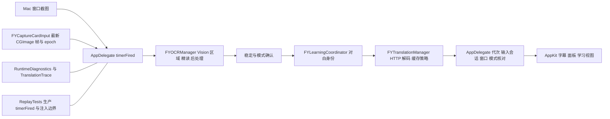

# 译芽 iPadOS Lite 可行性与实施方案

审查日期：2026-10-08。源码基线：`9553f925790fd641ab875c5ebdbd0b2d5b5a1b23`，Mac 0.2.1。结论：技术方向有 Apple API 支持，可以开展独立采集 PoC；尚不能确认目标 iPad 与采集卡兼容，更不能认定移植成功。第二阶段真机采集通过是第三阶段的硬性前置条件。

## 平台条件

Apple 在 [WWDC23 外接相机说明](https://developer.apple.com/videos/play/wwdc2023/10106/)中明确：iPadOS 17 开始，USB-C iPad 可以通过 AVFoundation 使用符合 UVC 的外接视频设备。发现条件为 `.external`、`.video`、`.unspecified`，可接 `AVCaptureVideoDataOutput` 与预览层。设备重连会产生新的设备实例，通知可能在后台线程触发，需要串行处理；外接预览默认可能镜像，应对 HDMI 游戏画面关闭镜像。这证明 API 路径成立，具体 HDMI 采集卡兼容性仍由真机测试决定。

评估范围为 USB-C iPad；Lightning 机型不列为此 PoC 的支持目标。USB 带宽、线材、供电、集线器、采集卡固件及输出格式都进入兼容矩阵。不能由“USB-C 接口”推导必有相同带宽，也不能由枚举到设备推导已收到 Switch 画面。采集卡可能在 HDMI 无信号时持续发送黑帧，帧计数也不能证明游戏接入成功。

本机当前开发入口是 `/Library/Developer/CommandLineTools`，Swift 6.0.3；`xcodebuild -version` 和 `xcrun --sdk iphoneos --show-sdk-path` 均失败，`devicectl` 不可用。需要完整 Xcode、iPadOS SDK、开发签名及目标真机，才能进行设备构建和安装。不会通过更改全局开发工具路径或下载大型工具自动绕过此条件。

## 现有架构与依赖

`objc/LiveCaptionTranslator.m` 约 8,976 行，负责配置、定时器、工作队列、翻译编排和 UI。不是独立的跨平台管线。Mac 构建脚本显式列举 Objective-C 源文件并链接 Cocoa、Carbon、Vision、AVFoundation、Sparkle 等；新 iPad 目录不会自动进入 Mac 构建。

`FYOCRManager` 负责 Vision 识别、按图高调整识别阈值、裁剪与坐标回映、精读合并、字幕带、说话人和界面判断、跨帧字段稳定。`FYCaptureCardInput` 使用 AVFoundation、CoreImage、单一 CGImage 帧槽、限速与会话 epoch。翻译模块提供 Chat Completions URL 验证、15 秒超时请求、HTTP/JSON 解码、对白单项缓存和界面批量缓存策略。运行状态及服务配置代次仍由 AppDelegate 持有。

## 复用清单

| 模块 | 复用判断 | 最小调整与验证边界 |
| --- | --- | --- |
| FYTranslationManager.h/m | 高，Foundation 实现 | 保留请求、URL 校验、解码、缓存与主队列交付函数；用桥接接入 Swift，不用 Swift 再写一套协议。错误 UI 仅显示安全摘要，不能将失败响应正文写入诊断。 |
| FYTranslationRunState / Cache / TaskOwner | 高，但不是完整调度器 | 复用节流与缓存，维持主线程所有者合同；注意替换 activeTask 本身不会取消旧任务。服务配置变更仍须作废旧任务。 |
| FYOCRManager 与 OCRTextItem | 有条件，高 | `.h` 当前导入 Cocoa；`.m` 使用 NSMinX/NSWidth、NSValue.rectValue/valueWithRect。需改为 Foundation/CoreGraphics 与明确的 CGRect 装箱适配；Vision 支持两端，但识别差异需要 iPad 实测。 |
| FYOCRStabilityOwner / FYContentModeStability / FYInlineOCRFrameStabilizer | 算法可复用 | 同一实现，保留两帧确认、高相似修正与已确认字段边界；Lite 首轮只接对白路线，不启用复杂贴译。 |
| 字幕文本规范化、近似判断、提取与提示词 | 可复用，尚未独立 | 部分在 AppDelegate，部分在 LearningModels/Coordinator；逐项抽取纯函数与身份所有者，先用现有 Replay 证明行为一致。 |
| FYRequestIdentity / 对白身份 | 模型可复用，编排需拆分 | Coordinator 同时依赖学习数据库、分析器、词典等；Lite 不应为对白身份拉入整套学习系统。抽出连续对白身份及版本，保留 A→B→A 行为。 |
| FYRuntimeDiagnostics | 高，Foundation | 复用白名单、容量和导出策略，平台快照由适配器提供；不复制任意 NSError 描述。 |
| FYTranslationTrace | 事件合同可复用，控制方式需适配 | 当前目录和启用方式依赖 Mac `/tmp`、UID 与外部控制文件；iPad 使用沙盒内开关及私有导出，保留 session/cycle/frame/request/http_task 字段及默认不保存文字。 |
| FYLocalAPIKeyStore | 文件/版本策略可复用，路径需适配 | iPad 在自身沙盒 Application Support 保存，继续版本仅看 CFBundleShortVersionString、0700/0600、原子替换、失败保留旧文件，不接 macOS Keychain；后续排除系统备份并验证文件保护。PoC 不读取或保存 Key。 |
| FYCaptureCardInput | AVFoundation 思路和合同可复用，非直接编译 | Mac 的 externalUnknown/接力相机过滤、设备占用等不能照搬；iPad 新适配器用 external。PoC 直接保留 CVPixelBuffer，避免每个预览帧转换 CGImage。 |
| ReplayTests / scripts/debug.py | 夹具与断言保留，驱动需扩展 | 当前驱动调用含 AppKit 的生产 AppDelegate；未来共享核心驱动仍注入输入、Vision 和 HTTP 边界，同一生产后处理与交付策略。现阶段不重写“模拟翻译算法”。 |
| 窗口、几何、悬浮字幕、快捷键、学习视图、Sparkle | Mac 专用 | FYWindowManager、FYGeometryManager、CGWindowListCreateImage、NSPanel/NSView/NSScreen、Carbon、全局事件与 Sparkle 不进入 iPad target。 |

## 已确认的重要风险

1. **快切对白验收当前未满足。** `timerFired:` 在 `inFlight` 时直接返回，HTTP 期间不再采集/OCR 新对白。现有 `tests/fixtures/replay/known-gaps/latest-frame-while-busy.json` 用“画面已到 C 后不应用 A”断言暴露此缺口。generation/epoch 只保护重启、断开、模式等变化，不能证明同会话内 A→B 的新鲜度。第三阶段须先保留失败回归，再让 OCR 与网络解耦，并按已观察的对白身份/版本核对交付。不能未经另行验证声称消除了物理画面与 OCR 之间的采样窗口。
2. **采集 API 可用不等于具体硬件可用。** Mac README 已记录 QuickTime 有画面但直接采集没有帧的现场问题，根因未确认。iPad 必须分别验证设备枚举、实际缓冲到达和 Switch 内容可见。
3. **延迟、发热、内存与音频。** 初始目标 720p/30，备选不超过 1080p，按设备支持范围协商；每秒少量 OCR、预览独立运行、有界帧槽。没有硬件实测前无延迟/功耗结论。视频 PoC 不采音频，不提供游戏声音；若玩家直接以 iPad 玩游戏，音频和可接受操作延迟是后续产品决策条件。
4. **中断与生命周期。** 插拔、锁屏、后台、系统相机占用、媒体服务重置都要清旧帧并递增 epoch；后台停止采集，前台按用户启动意图重新取得设备实例。重试必须有界，错误可见。
5. **OCR 输入语义。** 采集卡是干净源图，不能按已显示译文从原文删除同文；保留标准化坐标、字段边界、方向和镜像合同。
6. **数据隔离。** PoC 无 OCR、无 HTTP、无 API 配置、无画面/台词落盘。真实诊断素材须另行由用户明确启用，私有保存，不进入 Git 或发布包。

## 最小共享核心方案

在采集硬件门通过后才建立 `YiyaCore` Objective-C 静态库或 Clang target，SwiftUI 使用薄桥接层。首先直接引用现有翻译源文件；再以小改动消除 OCR 的 Cocoa 和 NSRect 装箱依赖；最后抽取对白身份、稳定判断和实时调度。两个平台引用同一批生产文件，Mac 保持原入口作为适配层，避免整段搬迁与无关重构。

边界：FrameSource 提供 `pixelBuffer/CGImage + inputEpoch + frameIndex + PTS + receivedMonotonicTime`；VisionAdapter 负责平台图像输入与识别；核心处理规范化、稳定、身份、请求去重、缓存和结果归属；TranslationTransport 注入 NSURLSession；Presentation 接收不可变字幕状态；Diagnostics 接收白名单事件。Clock 与网络/识别边界可注入，以维持确定性的 Replay。

后续运行模型建议为最新帧槽 1 项、OCR 最多 1 个执行任务、网络有限并发或当前任务加最新候选 1 项；OCR 不等待 HTTP。新对白候选出现时需先阻止旧结果交付，再经过稳定确认提交新请求；请求取消只减少浪费，最终仍以 generation/inputEpoch/sentenceID/version/serviceGeneration 校验。暂停、断开、改配置清除待处理状态。缓存保持现有身份语义，失败不缓存，不引入无上限字典。

## 阶段与继续条件

| 阶段 | 交付与真实结果 | 继续条件 |
| --- | --- | --- |
| 1 工程审查 | 本报告与源代码依赖核查 | 可以创建隔离 PoC，不影响 Mac |
| 2 采集 PoC | `ipados/CapturePoC` 独立 SwiftUI/Xcode 工程、像素帧槽、统计、状态、硬件检查表 | 目标 USB-C iPad 真机接收 Switch，预览方向/比例正确，像素缓冲连续到达，插拔/中断可恢复，持续运行通过；证据与失败原因填写后才通过 |
| 3 共享翻译核心 | 按上述顺序抽取并接入，保留 Mac Debug/Replay | 第二阶段真机 PASS，之后 OCR、合成 HTTP、乱序与快切回归通过 |
| 4 Lite UI | 真实预览、可选中文、状态、启动/暂停翻译、API 配置与错误 | 接入第三阶段，保持奶油棕花境、触控可用、原生文本选择，不做学习/浮窗 |
| 5 联合验收 | 真机全链路及 Mac 回归报告 | 不以编译、模拟器、合成数据或 Mac 实测替代 iPad 验收 |

第二阶段最小界面只有设备选择、启动/暂停采集、视频预览和状态/帧统计。翻译、OCR 与 API 配置留到门通过后；不显示假台词或假译文。对应验证操作与记录见 [采集 PoC 说明](../ipados/CapturePoC/README.md) 和 [硬件验收表](../ipados/CapturePoC/HARDWARE_VALIDATION.md)。本轮实际命令、结果与尚未通过的项目记录在 [验证记录](ipados-lite-validation.md)。

## 参考

- [Apple 外接相机支持](https://developer.apple.com/videos/play/wwdc2023/10106/)
- [AVCaptureDevice.external](https://developer.apple.com/documentation/avfoundation/avcapturedevice/devicetype-swift.struct/external)
- [采集权限](https://developer.apple.com/documentation/avfoundation/requesting-authorization-to-capture-and-save-media)
- [TN2445 丢帧与有界处理](https://developer.apple.com/library/archive/technotes/tn2445/_index.html)
- [项目 Debug 工作流](../DEBUG_WORKFLOW.md)、[OCR 稳定合同](inline-ocr-stability.md)、[凭据合同](api-key-storage.md)
